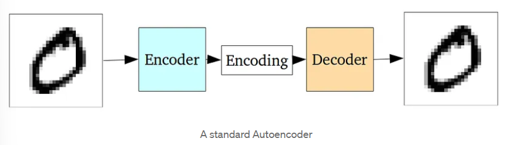
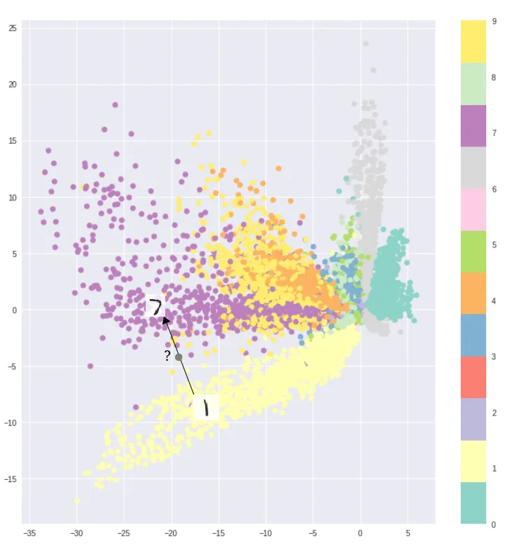
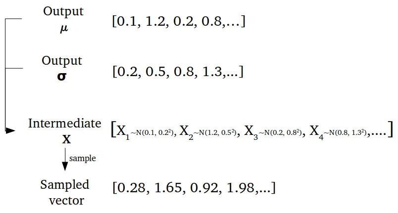
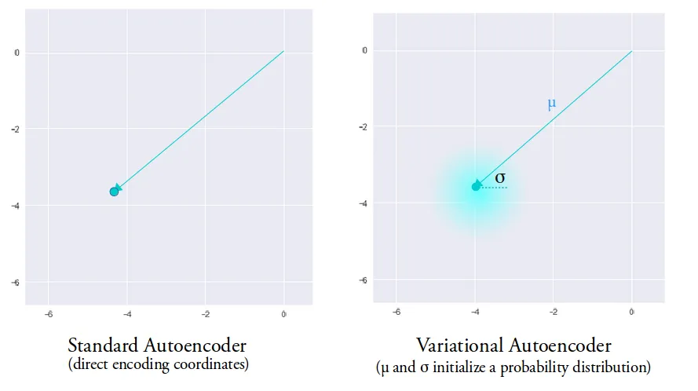
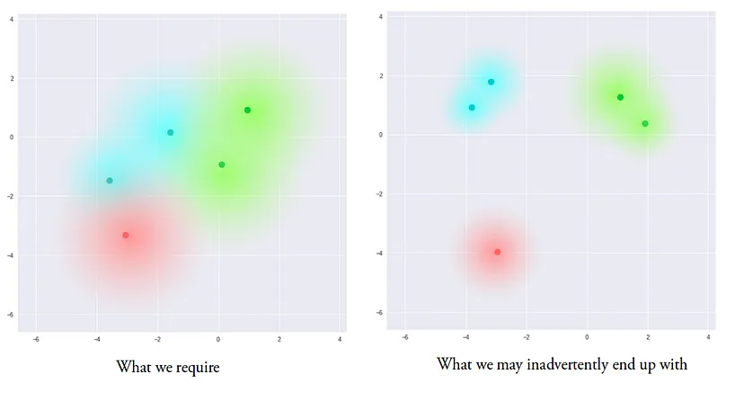
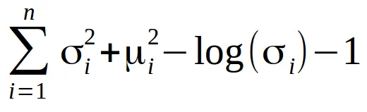
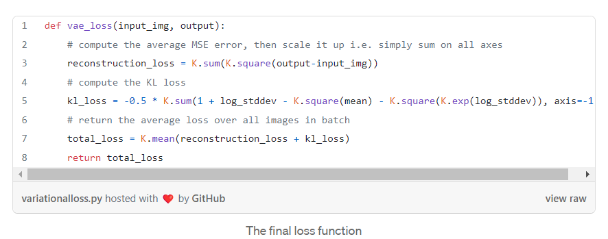
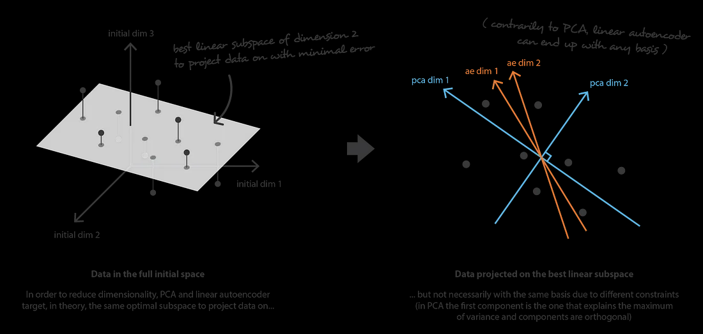
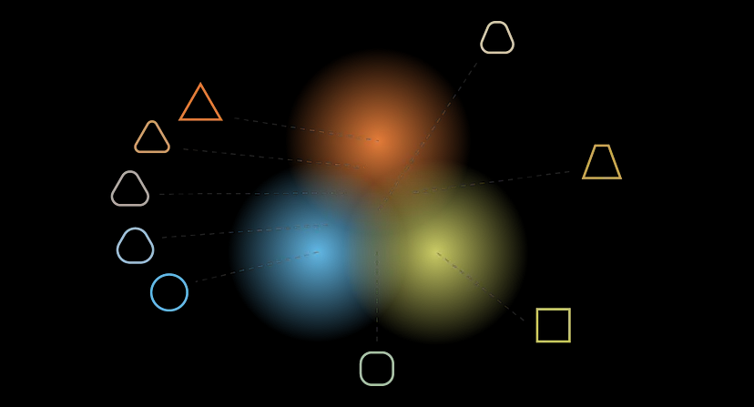
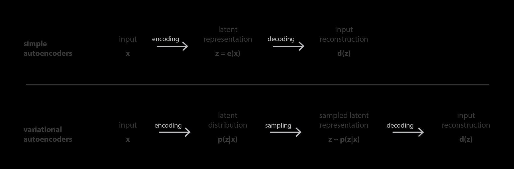

## KNOWLEDGE I HAD

i knew the basics of computer vision,CNN's and their application in neural style transfer ,object detection and classification  from the Andrew ng course on coursera.very basic know how of pytorch.

Whats new for me

AutoEncoders.

what is too hard to understand

statistical technique of variational inference

## BLOG

i first started with reading the article provided namely"Intuitively understanding varaitional autoencoders"

from this i understood

1)VAE's are generative models that alters the given input in a specific manner.

2)auto encoders are pair of two connected networks-encoders(converts input into smaller dense representation)and   decoders(converts the encoded image back to original image).

3)loss funtion are usually-MSE or CrossEntropy.

4)reconstruction loss is used to penalize the network for recreating output different from input.

5)encoder learns to preserve important features needed to reconstrust the image and discard irrelevant parts. it learns so by the help of the loss function.

6)the decoder learns to take the encoding properly reconstrict it  into a full image.

# NOTE ON STANDARD ENCODERS

Standard autoencoders learn to generate compact representations and reconstruct their inputs well, but asides from a few applications like denoising autoencoders, they are fairly limited.

understanding the problem with auto encoders.

The fundamental problem with autoencoders, for generation, is that the latent space they convert their inputs to and where their encoded vectors lie, may not be continuous, or allow easy interpolation.

the encoders learns to create quite distinct encodings for each class making it easier for decoder to decode it.This is fine if we are just *replicating* the same images.

these distinct encodings create discontinuity in the latent space.

But when you’re building a *generative *model, you **don’t** want to prepare to *replicate* the same image you put in. You want to randomly sample from the latent space, or generate variations on an input image, from a continuous latent space.

If the space has discontinuities (eg. gaps between clusters) and you sample/generate a variation from there, the decoder will simply generate an unrealistic output, because the decoder has *no idea *how to deal with that region of the latent space. During training, it *never saw* encoded vectors coming from that region of latent space.

Variational Autoencoders

They have continuous latent spaces allowing easy random sampling and interpolation.

it acieves this by making its encoder not outputing an encoding vector of size n rather outputing two vector of size n(n is number of features in encoding vector)-

1)A vector of means(µ).2)And another vector of standard deviations.(**σ**)

They form the parameters of a vector of random variables of length n, with the *i *th element of **μ** and **σ **being the mean and standard deviation of the* i *th random variable, **X **i, from which we sample, to obtain the sampled encoding which we pass onward to the decoder:

This stochastic generation means, that even for the same input, while the mean and standard deviations remain the same, the actual encoding will somewhat vary on every single pass simply due to sampling.

Intuitively, the mean vector controls where the encoding of an input should be centered around, while the standard deviation controls the “area”, how much from the mean the encoding can vary. As encodings are generated at random from anywhere inside the “circle” (the distribution), the decoder learns that not only is a single point in latent space referring to a sample of that class, but all nearby points refer to the same as well. This allows the decoder to not just decode single, specific encodings in the latent space (leaving the decodable latent space discontinuous), but ones that slightly vary too, as the decoder is exposed to a range of variations of the encoding of the same input during training.

the encoder can learn to generate very different **μ** for different classes, clustering them apart, and minimize  **σ** , making sure the encodings themselves don’t vary much for the same sample (that is, less uncertainty for the decoder). This allows the decoder to efficiently reconstruct the *training* data.

What we ideally want are encodings, *all* of which are as close as possible to each other while still being distinct, allowing smooth interpolation, and enabling the construction of *new *samples.

to achieve this we use KULLback-Leiber divergence(KL divergence)

The KL divergence between two probability distributions simply measures how much they *diverge* from each other. Minimizing the KL divergence here means optimizing the probability distribution parameters **(μ** and **σ) **to closely resemble that of the target distribution.

It’s minimized when μ*i* = 0, σ*i* = 1.

Intuitively, this loss encourages the encoder to distribute all encodings (for all types of inputs, eg. all MNIST numbers), evenly around the center of the latent space. If it tries to “cheat” by clustering them apart into specific regions, away from the origin, it will be penalized.

# Vector arithmetic

So how do we actually produce these smooth interpolations we speak of? From here on out, it’s simple vector arithmetic in the latent space.

Interpolating between samples

For example, if you wish to generate a new sample halfway between two samples, just find the difference between their mean ( **μ** ) vectors, and add half the difference to the original, and then simply decode it.

Adding new features to samples

What about generating * specific features* , such as generating glasses on a face? Find two samples, one with glasses, one without, obtain their encoded vectors from the encoder, and save the difference. Add this new “glasses” vector to any other face image, and decode it.

# Understanding Variational Autoencoders (VAEs)

## Building, step by step, the reasoning that leads to VAEs.

 If we denote respectively E and D the families of encoders and decoders we are considering, then the dimensionality reduction problem can be written

N the number of data, n_d the dimension of the initial (decoded) space and n_e the dimension of the reduced (encoded) space.

## Principal components analysis (PCA)(didn't understand the math eigwn vectors and values)

## autoencoders

Let’s first suppose that both our encoder and decoder architectures have only one layer without non-linearity (linear autoencoder). Such encoder and decoder are then simple linear transformations that can be expressed as matrices. In such situation, we can see a clear link with PCA in the sense that, just like PCA does, we are looking for the best linear subspace to project data on with as few information loss as possible when doing so. Encoding and decoding matrices obtained with PCA define naturally one of the solutions we would be satisfied to reach by gradient descent, but we should outline that this is not the only one. Indeed, **several basis can be chosen to describe the same optimal subspace** and, so, several encoder/decoder pairs can give the optimal reconstruction error. Moreover, for linear autoencoders and contrarily to PCA, the new features we end up do not have to be independent (no orthogonality constraints in the neural networks).

an important dimensionality reduction with no reconstruction loss often comes with a price: the lack of interpretable and exploitable structures in the latent space ( **lack of regularity** ). Second, most of the time the final purpose of dimensionality reduction is not to only reduce the number of dimensions of the data but to reduce this number of dimensions  **while keeping the major part of the data structure information in the reduced representations** . For these two reasons, the dimension of the latent space and the “depth” of autoencoders (that define degree and quality of compression) have to be carefully controlled and adjusted depending on the final purpose of the dimensionality reduction.

# Takeaways

The main takeways of this article are:

* dimensionality reduction is the process of reducing the number of features that describe some data (either by selecting only a subset of the initial features or by combining them into a reduced number new features) and, so, can be seen as an encoding process
* autoencoders are neural networks architectures composed of both an encoder and a decoder that create a bottleneck to go through for data and that are trained to lose a minimal quantity of information during the encoding-decoding process (training by gradient descent iterations with the goal to reduce the reconstruction error)
* due to overfitting, the latent space of an autoencoder can be extremely irregular (close points in latent space can give very different decoded data, some point of the latent space can give meaningless content once decoded, …) and, so, we can’t really define a generative process that simply consists to sample a point from the latent space and make it go through the decoder to get a new data
* variational autoencoders (VAEs) are autoencoders that tackle the problem of the latent space irregularity by making the encoder return a distribution over the latent space instead of a single point and by adding in the loss function a regularisation term over that returned distribution in order to ensure a better organisation of the latent space
* assuming a simple underlying probabilistic model to describe our data, the pretty intuitive loss function of VAEs, composed of a reconstruction term and a regularisation term, can be carefully derived, using in particular the statistical technique of variational inference (hence the name “variational” autoencoders)

To conclude, we can outline that, during the last years, GANs have benefited from much more scientific contributions than VAEs. Among other reasons, the higher interest that has been shown by the community for GANs can be partly explained by the higher degree of complexity in VAEs theoretical basis (probabilistic model and variational inference) compared to the simplicity of the adversarial training concept that rules GANs. With this post we hope that we managed to share valuable intuitions as well as strong theoretical foundations to make VAEs more accessible to newcomers, [as we did for GANs earlier this year](https://towardsdatascience.com/understanding-generative-adversarial-networks-gans-cd6e4651a29). However, now that we have discussed in depth both of them, one question remains… are you more GANs or VAEs?
