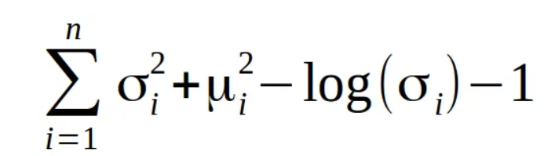
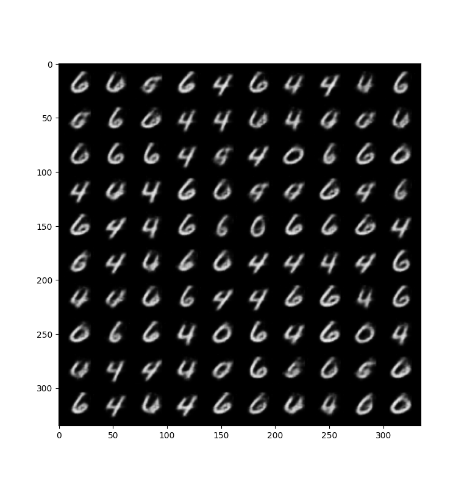
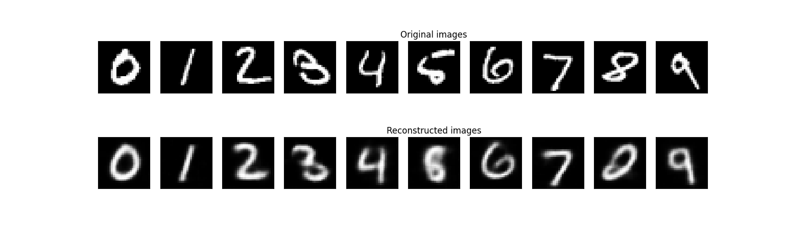
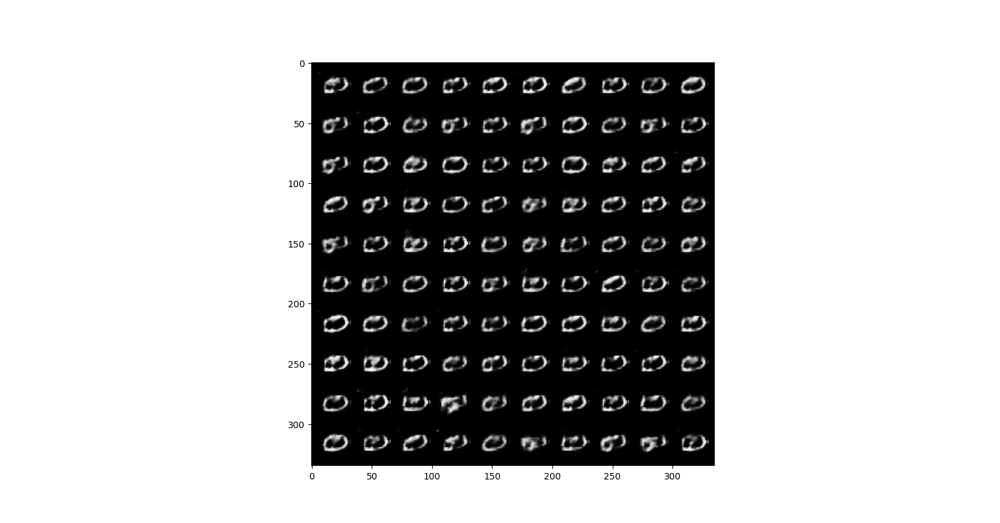

# VAE IMPLEMENTATION ON MNSIT

## what i knew already

python basics

theory of CNN(padding,stride,kernel,channel) ,BatchNorm,

pytorch

## sources referred

[for network achitecture](https://medium.com/dataseries/convolutional-autoencoder-in-pytorch-on-mnist-dataset-d65145c132ac)

[youtube tutorial](https://youtu.be/VELQT1-hILo?si=AuS6bvygleaZaGPo)

and other sources provided for knowledge in the pdf

# BLOG

## Day 0

i started by reading all the material provided by saidl in the pdf and made notes about everything important.i learned about the basics of VAE's and why we use kl divergence in the loss funtion.but the maths was very perplexing for me at the present and keeping in mind the assignment deadline i decided to skip through it.

## Day 1

i created the encoding and  decoding network architecture seperately.

The encoder took image object from the dataloader.The encoding network included conv layers, batchnorm ,relu activation followed by fully connected layers

it outputted two tensors mu and sigma .denoting a probablity distribution in vector space.

this probablity distribution was then sampled to get Z which was then inputted in the decoder.

decoder had a similar architecture to encoder but in reverse it iniatiallly started with linear layers, convtranspose,batchnorm,and relu.

i defined the loss function=MSELOSS(x,g(f(X)))-K.Ldivergence

i found various expression for kl divergence

but this didnt work for me in the original format.

### problems and how did i solve

on the first run my loss was coming as NaN, so i looked it up on the web tried various trouble shooting steps and realised an obvious flaw that the sigma tensor return by the encoder network was consisitng of negative values and passing that to log caused this error.to fix this i decided to take absolute value of the sigma while creating the sigma tensor and also added 1e-6 with sigma while taking log to prevent 0 input to the log.I tested my fix and it solved the Nan issue.

next problem that i faced was with the loss value coming out to be negative first i belived it was a good thing as loss becoming more negative meant loss function is reducing but when i plotted out the results it was a huge mess and the reconstructed images were random.

(NOTE- at the time of coding i have treated the plotting functions as a black box i have modified it to fit my purpose and if time allows i will later understand techniques of dimentional reduction for plotting )

i again started my hunt for a good loss function for kl divergence and i found out that in some implementation a coefficient of 0.5 is multiplied to kl divergence term i tried that in my application and the loss became less negative and the results started to improve marginally.

## Day 2

On this day i did hyperparameter tuning, tried a huge variety of learning rate and a kl divergence coefficent (lets call it beta).i got the loss down to 0.023 on the training set using a learning rate of 0.001 and beta=5e-6(some random value i found on the net) and then on the trained model i iterated for the values of beta if beta got too small the data started to become more spaced out from each class and if the beta became very large loss became negative and data got cluttered.i tested each beta for 20 epochs and it took me around 2 hours to land on beta=0.11 , (this value can further be improved).

for the learning rate i didnt spend much time to find a perfect lr.LR of 0.0001 for 200 epochs followed by a learning rate of 0.00005 for another 200 epochs produced satisfactory results .

#### latent space plot

#### random generations from latent space sampled from a normal distribution

#### reconstructed images of original sample

# Message for evaluator

i was unable to understand what did points 2) and 3) wanted me to do when i sampled the latent space from gaussian (1,2) i got results which were a mixture of digits 0,6,9,8 with primary depiction towards zero.

